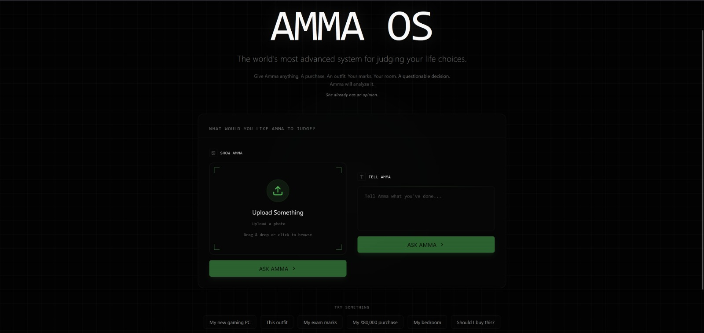
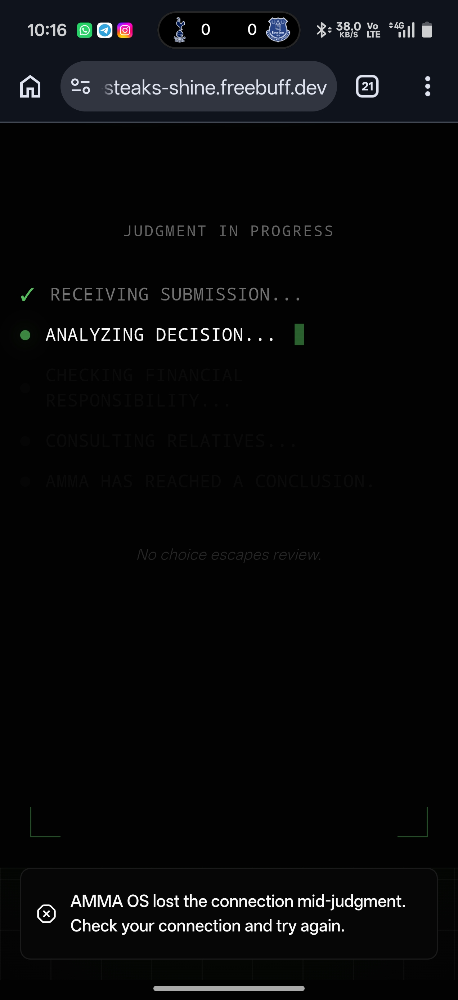
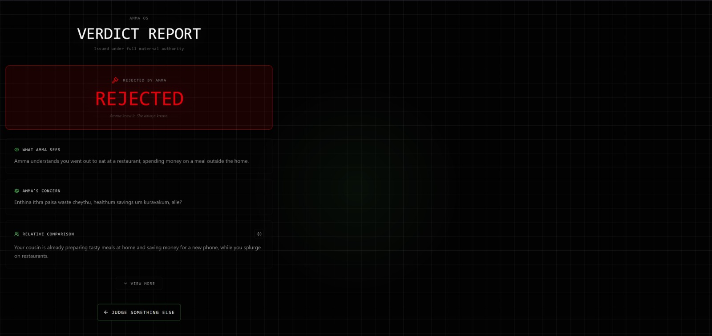

# ASK AMMA 🎯

> **She already has an opinion.**

## Basic Details

### Team Name
**Idealess**

### Team Member
- **Muhammed Yusuf Naushad** — Cape College of Engineering, Alappuzha

---

## Project Description

**ASK AMMA** is a multimodal AI judgment machine that analyzes your choices, purchases, food, gadgets, and everyday decisions through **text or images**, then delivers a brutally honest Malayali-mother verdict:

**APPROVED** or **REJECTED**.

The AI understands what you submit and evaluates it using practicality, spending, usefulness, effort, education, common sense, consequences, and classic family logic.

Because sometimes the only opinion that matters is:

> **"What would Amma say?"**

---

## The Problem (that doesn't exist)

People make countless decisions every day without knowing what a Malayali mother would think about them.

What if you bought something expensive?

What if you studied for eight hours?

What if you ordered an unnecessarily expensive burger?

There was clearly no reliable technological system for answering the most important question:

> **"What would Amma say?"**

---

## The Solution (that nobody asked for)

ASK AMMA lets you submit **either text or an image** and asks:

> **"What would Amma think?"**

The AI analyzes the submission and considers factors such as:

- Practicality
- Spending
- Usefulness
- Effort
- Education
- Common sense
- Consequences
- Family comparisons

It then delivers the only verdict that matters:

### APPROVED BY AMMA

or

### REJECTED BY AMMA

The system can also respond with Manglish and familiar Malayali-mother logic, because no proper Amma verdict is complete without:

> **"Enthina ithra paisa?"**

or

> **"For studying, alle?"**

---

## Technical Details

### Technologies / Components Used

**Software:**

- TypeScript
- JavaScript
- React
- Vite
- Tailwind CSS
- Groq API
- Groq Vision
- Framer Motion
- Lucide React
- React Router
- GitHub

**Deployment:**

- Vercel / Freebuff

**Hardware:**

- No hardware components were used.
- ASK AMMA is completely software-based.

---

## Implementation

### How It Works

```text
USER
  |
  v
TEXT OR IMAGE
  |
  v
GROQ AI
  |
  v
UNDERSTAND SUBMISSION
  |
  v
AMMA REASONING
  |
  +-----------------------+
  |           |           |
  v           v           v
MONEY    PRACTICALITY   USEFULNESS
  |           |           |
  +-----------+-----------+
              |
              v
      RELATIVE COMPARISON
              |
              v
         AMMA VERDICT
          /         \
         /           \
        v             v
   APPROVED        REJECTED
```

### Installation

```bash
npm install
```

### Run

```bash
npm run dev
```

---

## Project Documentation

### Screenshots


*The ASK AMMA interface where users can submit either text or an image for judgment.*


*The judgment sequence as AMMA OS analyzes the submitted decision.*


*The final verdict report showing Amma's reasoning and APPROVED or REJECTED decision.*

---

## Project Demo

### Live Demo

https://dry-steaks-shine.freebuff.dev/

### GitHub Repository

https://github.com/mfusuyn/amma-os

### Demo Video

<!-- TODO: paste your demo video link here -->

---

## Team Contributions

**Muhammed Yusuf Naushad** (solo build)

- Concept development
- UI/UX design
- Frontend development
- Groq AI integration
- Text analysis
- Image analysis
- AI reasoning system
- Testing
- Deployment
- GitHub management
- Documentation
- Overall project development

---

## Why ASK AMMA?

Because the world already has:

- AI assistants
- Recommendation engines
- Search engines
- Decision-making systems

What it didn't have was a technological system capable of answering the question:

> **"Amma, should I do this?"**

Now it does.

---

**Made with ❤️ at TinkerHub Useless Projects**


